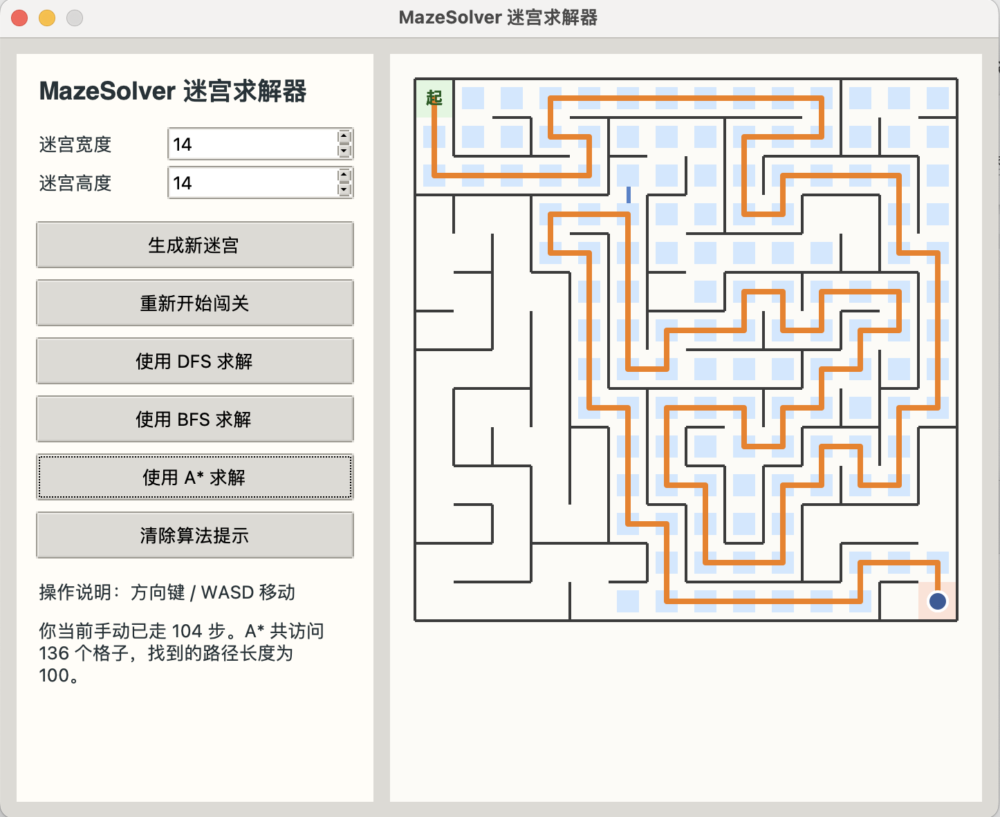

# MazeSolver

`MazeSolver` 是一个面向数据结构与算法课程大作业设计的 Python 迷宫游戏与算法可视化项目。程序可以随机生成迷宫，并分别使用 DFS、BFS 和 A* 三种算法进行求解，帮助使用者直观比较不同搜索策略在同一问题上的表现差异。



## 项目背景

本项目希望把课堂上学到的“栈、队列、图遍历、优先队列、启发式搜索”等知识点放进一个完整的小型工程中，而不是只停留在纸面推导或命令行输出结果。相比单纯打印路径，MazeSolver 更强调算法过程的可视化展示，使迷宫生成与求解过程都更容易观察和理解。

## 核心功能

- 使用基于显式栈的迭代 DFS 回溯算法随机生成迷宫。
- 对同一个迷宫分别使用 DFS、BFS 和 A* 进行求解。
- 使用 Tkinter 图形界面展示搜索访问过程与最终路径。
- 对比不同算法访问结点数量和路径长度的差异。
- 提供基础单元测试，验证迷宫连通性和求解器正确性。

## 课程知识点应用

### 1. 迷宫生成：栈 + 图遍历

项目把迷宫看成一个隐式网格图：

- 每个格子可以视作图中的一个顶点。
- 相邻格子之间的连通关系可以视作边。
- 生成迷宫时，使用显式栈模拟深度优先搜索。
- 每一步随机选择一个尚未访问的相邻结点，打通两格之间的墙。
- 当当前格子没有可扩展结点时，执行回溯。

这样得到的迷宫本质上是网格图上的一棵生成树，因此任意两点之间都只有唯一简单路径，既保证了迷宫可解，也能体现 DFS 回溯思想。

### 2. DFS 求解

- 使用栈维护待搜索状态。
- 能较快找到一条可行路径。
- 不保证得到最短路径。

### 3. BFS 求解

- 使用队列 `collections.deque` 进行层序扩展。
- 在无权图模型下保证最短路径。
- 很适合与 DFS 进行路径质量对比。

### 4. A* 求解

- 使用优先队列 `heapq` 维护搜索前沿。
- 代价函数由“当前真实路径代价 + 曼哈顿距离启发值”组成。
- 在本项目迷宫模型中通常比 BFS 更有方向性，同时仍能得到最优路径。

### 5. 数据结构设计

- `Maze` 类负责维护网格、墙体信息、起点与终点。
- `set` 用于去重和访问标记。
- `dict` 记录父结点，用于最终路径回溯。
- `list`、`deque`、`heapq` 分别对应不同搜索策略所需的数据结构。

## 项目结构

```text
MazeSolver/
├── src/
│   ├── maze.py
│   ├── solvers.py
│   └── ui.py
├── docs/
│   ├── assets/
│   ├── MazeSolver_Submission.docx
│   └── MazeSolver_Submission.pdf
├── tests/
│   ├── test_maze.py
│   └── test_solvers.py
├── main.py
├── README.md
├── LICENSE
└── requirements.txt
```

## 运行方法

### 环境要求

- Python 3.10 及以上
- 本地 Python 环境可使用 `tkinter`

### 启动图形界面

```bash
python3 main.py
```

### 运行测试

```bash
python3 -m unittest discover -s tests -v
```

## 实现说明

- 项目运行时仅依赖 Python 标准库。
- 算法逻辑与图形界面代码分离，便于维护与扩展。
- 可在界面中调整迷宫宽度和高度后重新生成迷宫。

## 建议的 GitHub 仓库名

`MazeSolver`

创建仓库后，可将仓库链接替换为：

`https://github.com/your-username/MazeSolver`

## AI 工具使用声明

本项目在需求梳理、工程结构规划、文档润色和部分样板代码编写过程中使用了 AI 工具进行辅助。迷宫建模、DFS/BFS/A* 的核心逻辑设计、测试组织和整体项目结构均经过人工检查与调整，以确保符合课程要求并保证代码可解释性。

## 参考与学术诚信说明

- 项目核心算法均为自行实现。
- 图形界面仅使用 Python 标准库中的 Tkinter。
- 未使用第三方算法库替代课程要求中的核心搜索逻辑。
